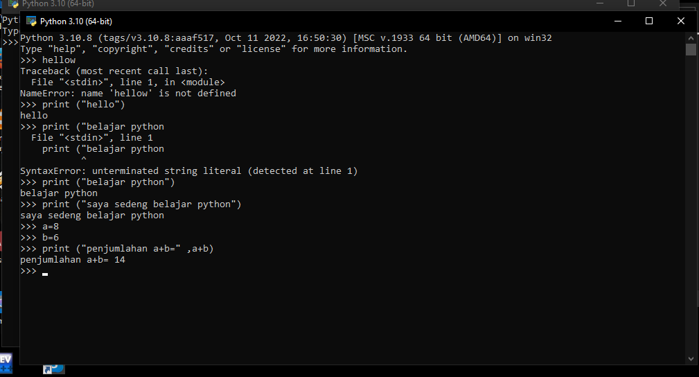
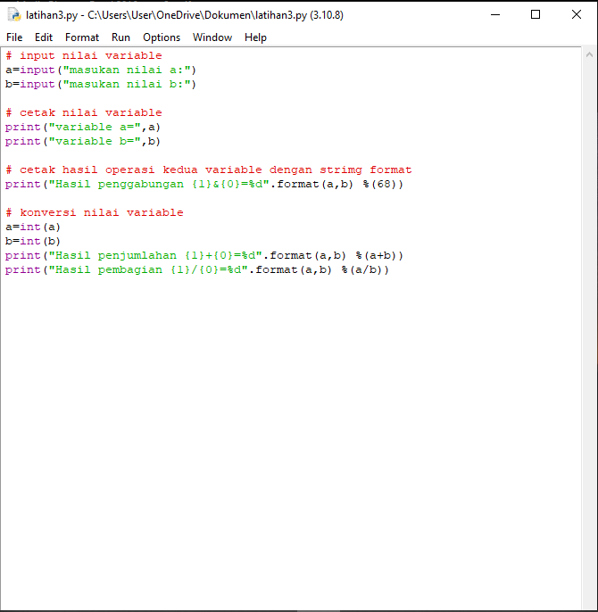
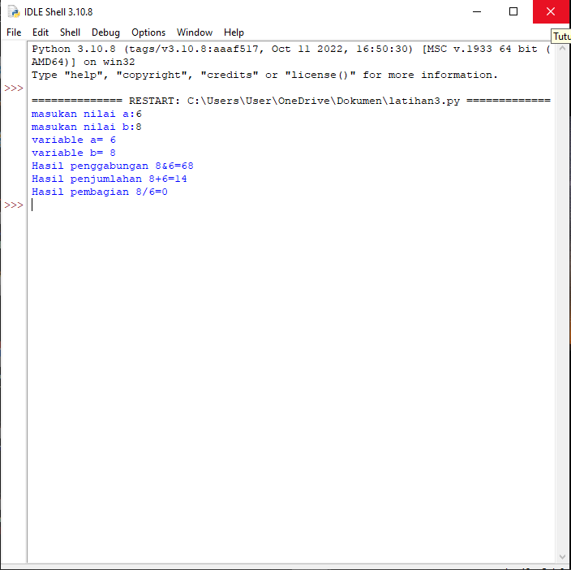

# lab2py
## latihan3 lab2py

### Langkah-langkah Menjalankan Python, IDLE, dan PyCharm
### Latihan 1
### Menjalankan Python Console
### Menampilkan tulisan "Hello" di layar Dan Menampilkan tulisan "Saya Sedang Belajar python" Harus Menunggunakan Perintah "print"
contoh:
print("Hello")
print("Saya Sedang Belajar Pyhton")
### Menjumlahkan dua buah bilangan menggunakan variable a dan b
Mendefinisikan variable a dengan nilai 8
mendefinisikan variable b dengan nilai 6
Mencetak hasil variable a dan b
Mencetak hasil penjumlahan a+b
### Hasil Praktikum

### Menjalankan IDLE
### langkah 2
Membuat file baru dengan nama latihan3.py (pastikan lokasi file pada folder lab2py pada direktori kerja anda)
Menggunakan fungsi input untuk mengambil nilai variable dari keyboard
Dan di running
### Hasil Praktikum

### Menjalankan PyCharm
### Langkah 3
Create New Project
Latihan3
Dan Nama File main.py
### Hasil Praktikum
